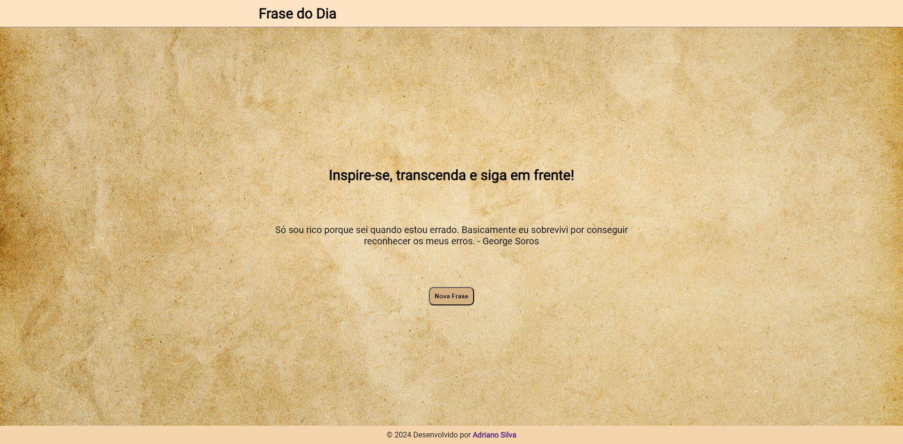

<h1>Projeto: Site Frases do Dia</h1>

O presente projeto consiste em um website destinado à disponibilização de frases motivacionais diárias e aleatórias, visando inspirar e motivar os usuários.

<h2>Objetivo</h2>

O objetivo principal deste projeto é desenvolver um website capaz de fornecer automaticamente uma frase motivacional de acordo com a data do dia. Adicionalmente, os usuários terão a possibilidade de gerar uma frase aleatória através de um botão específico.

<h2>Estrutura de Arquivos - Metodologia em Camadas</h2>
<ul type="1">
  <li><strong>Camada:</strong> Estruturação das pastas - a pasta principal do website contém subdiretórios para os recursos, scripts e estilos.</li>
  <li><strong>Camada:</strong> Desenvolvimento do código HTML da página.</li>
  <li><strong>Camada:</strong> Implementação do código JavaScript, incluindo uma coleção de objetos contendo frases motivacionais para exibição no documento HTML.</li>
  <li><strong>Camada:</strong> Estilização da página através do código CSS.</li>
</ul>

<h2>Tecnologias Utilizadas</h2>
<ul>
  <li><strong>HTML:</strong> A estrutura do website foi elaborada utilizando HTML (Hypertext Markup Language), proporcionando uma base sólida para o conteúdo da página.</li>
  <li><strong>CSS:</strong> O estilo visual do website foi estilizado com CSS (Cascading Style Sheets), aplicando técnicas avançadas como flexbox para layouts flexíveis e responsivos, além de efeitos de transição e transformação para garantir uma experiência de usuário agradável.</li>
  <li><strong>JavaScript:</strong> Para adicionar interatividade dinâmica, o website exibe frases inspiradoras diariamente, selecionadas aleatoriamente de uma coleção. Além disso, é implementada a funcionalidade de exibir uma frase correspondente ao dia do mês atual, proporcionando conteúdo personalizado aos usuários.</li>
</ul>

<h2>Como Contribuir</h2>

Caso deseje contribuir para o aprimoramento deste projeto, estamos abertos a receber feedbacks, sugestões e colaborações através da abertura de problemas (issues) ou envio de solicitações de pull requests. Valorizamos e agradecemos profundamente sua contribuição para a melhoria contínua deste projeto!

<h2>Contato</h2>

Se você tiver alguma dúvida, sugestão ou feedback, fique à vontade para entrar em contato comigo.
 
Espero que esta estrutura básica ajude você a criar o seu README. Sinta-se à vontade para personalizá-lo e adicionar informações adicionais que sejam relevantes para os seus exercícios. 
Continue acompanhando minha evolução! 
Deixe suas dicas, melhorias, opniões e incentivos. 
 
Entre com contato: 

